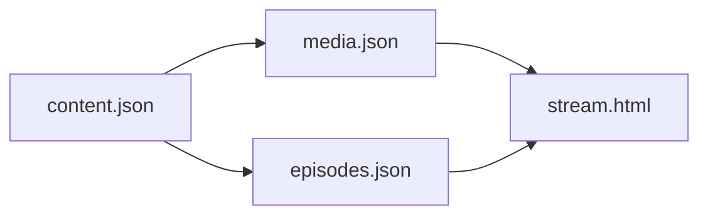
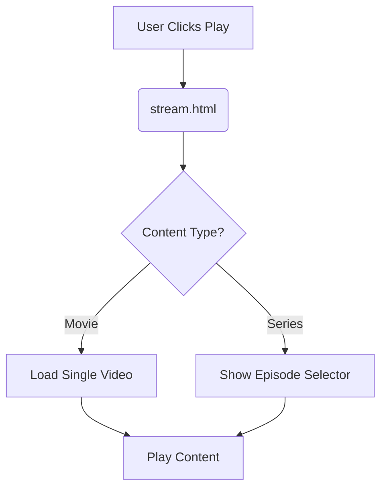
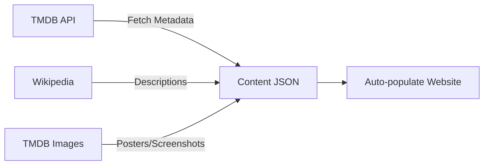
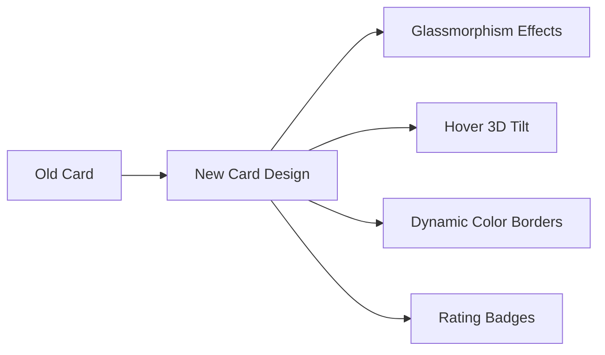

# StreamVerse Enhancement Plan

## Overview
This document outlines the comprehensive plan to transform the movie details page into a dedicated streaming page. The enhancements include video playback functionality, improved media management, and optimized performance and security features. This documentation is designed to be easily understood by both developers and AI systems.

## Key Terms
- **mediaRef**: Reference ID linking content to media.json  
- **episodesRef**: Reference ID linking series to episodes.json
- **Lazy Loading**: Technique to defer loading of non-critical resources
- **CSP**: Content Security Policy (security feature)
- **Sandboxing**: Security restriction for iframes

## Data Structure Changes

### New Files:
1. `media.json` - Stores trailers and screenshots
2. `episodes.json` - Stores episode data for series
3. `stream.html` - New streaming page

### File Relationships:


### Schema Updates:

**content.json:**
```json
{
  "id": "unique-id",
  "mediaRef": "same-as-id", // References media.json
  "episodesRef": "same-as-id", // References episodes.json
  // ... existing fields ...
}
```

**media.json:**
```json
{
  "interstellar": {
    "trailers": {
      "Original": "https://youtube.com/embed/...",
      "Hindi": "https://youtube.com/embed/..."
    },
    "screenshots": [
      "url1", "url2", "url3"
    ]
  }
}
```

**episodes.json:**
```json
{
  "attack-on-titan": [
    {
      "title": "Episode 1",
      "streamingUrl": "embed-url",
      "downloadUrl": "download-url",
      "subtitles": ["English", "Spanish"]
    }
  ]
}
```

## Implementation Workflow


## Comprehensive Implementation Plan

### 1. Content Population Strategy


**Steps:**
1. Create `tmdb_integration.js`:
   - Fetch movie/anime/series data from TMDB
   - Enhance with Wikipedia summaries
   - Generate image URLs using TMDB paths
2. Automate content.json population
3. Schedule weekly content updates

### 2. New Dedicated Pages
**File Structure:**
- `movies.html` - Filterable movie grid
- `anime.html` - Anime-specific content
- `series.html` - Web series collection

**Features:**
- Category-specific filtering
- Sorting (rating, date, title)
- Search within category
- Pagination

### 3. Card UI Redesign


**New Elements:**
- Gradient borders based on content type
- Micro-interactions on hover
- Integrated watchlist button
- Responsive design enhancements

### 4. Navbar Integration
```html
<nav>
  <a href="movies.html" class="nav-link">Movies</a>
  <a href="anime.html" class="nav-link">Anime</a>
  <a href="series.html" class="nav-link">Web Series</a>
</nav>
```

## Implementation Phases

### Phase 1: Data Structure Refactor (2 hours)
1. Create new JSON files (`media.json`, `episodes.json`)
2. Migrate existing media data from `content.json`
3. Update `content_schema.md` with new schemas
4. Add reference fields to `content.json` entries

### Phase 2: Streaming Page Implementation (4 hours)
1. Create `stream.html` based on `movie-details.html`
2. Implement page sections:
   - Main video player
   - Info grid (director/studio, episodes, etc.)
   - Trailers section (dropdown selector)
   - Screenshots section (image grid)
   - Synopsis
   - Comment/Request section
3. Create `stream.js` for data loading and interaction

### Phase 3: Performance Optimization (1.5 hours)
1. Add lazy loading for media:
   ```html
   
   <iframe loading="lazy" src="...">
   ```
2. Implement service worker for JSON caching
3. Set performance budget (max 200KB per JSON file)

### Phase 4: Security Enhancements (1 hour)
1. Add Content Security Policy:
   ```html
   <meta http-equiv="Content-Security-Policy" 
         content="default-src 'self'; 
                  media-src youtube.com vimeo.com;">
   ```
2. Implement iframe sandboxing:
   ```html
   <iframe sandbox="allow-same-origin allow-scripts allow-popups">
   ```
3. Add input validation for JSON data

### Phase 5: Testing & Documentation (1.5 hours)
1. Create test plan:
   - Cross-browser testing
   - Mobile responsiveness
   - Performance audits
2. Update documentation:
   - `MEDIA_SETUP.md` - Guide for adding content
   - `CONTENT_MANAGEMENT.md` - Data structure overview
3. Final validation:
   - Video playback testing
   - Episode switching functionality
   - Error handling verification

### Phase 1: Content Integration (3 days)
1. Implement TMDB API client
2. Create content population scripts
3. Generate initial dataset
4. Setup cron job for weekly updates

### Phase 2: Page Development (4 days)
1. Create movies.html with filtering
2. Develop anime.html with genre tags
3. Build series.html with season selector
4. Implement pagination logic

### Phase 3: UI Modernization (3 days)
1. Redesign content cards
2. Add hover animations
3. Implement responsive enhancements
4. Update color schemes

### Phase 4: Navigation & Finalization (2 days)
1. Integrate navbar links
2. Cross-browser testing
3. Performance optimization
4. Documentation updates

## Real-World Example
**Adding "Attack on Titan"**:
1. content.json:
   ```json
   {
     "id": "attack-on-titan",
     "mediaRef": "attack-on-titan",
     "episodesRef": "attack-on-titan",
     "type": "anime",
     "title": "Attack On Titan",
     "description": "An epic anime series...",
     // ... other fields ...
   }
   ```
2. media.json:
   ```json
   "attack-on-titan": {
     "trailers": {
       "Official": "https://youtube.com/embed/XYZ"
     },
     "screenshots": [
       "https://example.com/s1.jpg",
       "https://example.com/s2.jpg"
     ]
   }
   ```
3. episodes.json:
   ```json
   "attack-on-titan": [
     {
       "title": "To You, 2000 Years Later",
       "streamingUrl": "https://embed.com/ep1",
       "downloadUrl": "https://download.com/ep1",
       "subtitles": ["English", "Japanese"]
     }
   ]
   ```

## Maintenance Guide

### Adding New Content:
1. Add entry to `content.json`
2. Create corresponding entries in:
   - `media.json` (trailers/screenshots)
   - `episodes.json` (if series)
3. Use WebP format for images (<100KB)

### Updating Content:
1. Modify JSON files directly
2. Clear browser cache to see changes

### Troubleshooting:
- Check browser console for errors
- Validate JSON files using schema
- Verify CORS headers for external media

## LLM Guidance
When modifying this project:
1. Always consult this documentation first
2. Follow schema definitions precisely
3. Maintain data reference integrity
4. Key files to consider:
   - `stream.js`: Player logic
   - `media.json`: Media storage
   - `content_schema.md`: Data definitions
5. Test changes in this order:
   - Data validation
   - Video playback
   - Mobile responsiveness

## Rollback Plan
1. Git tags at each phase
2. Feature flag for new streaming page
3. Staged rollout (10% users initially)
